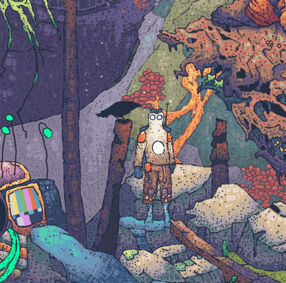
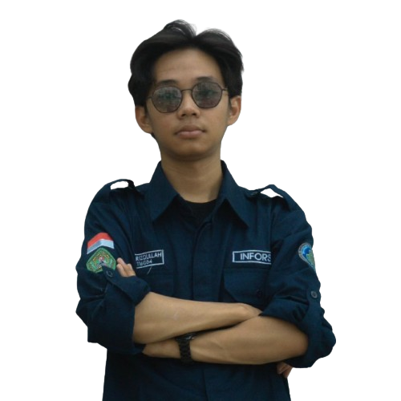
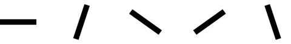
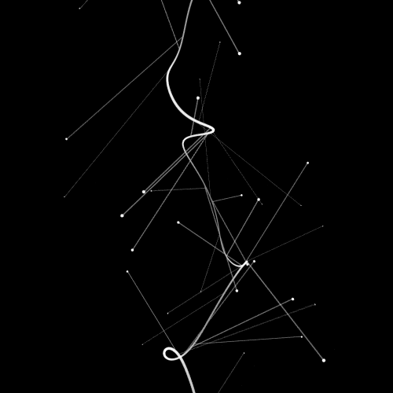

<!-- ==================== HEADER ==================== -->

<h2>@zecodee</h2>

Student College Mulawarman University

  

> *"Situation will teach what is real meaning of life"*

 

---

<!-- ==================== ABOUT ==================== -->

<h2>About Me 😈</h2>

<code>zecodee@github ~ $ ./profile-pict --deymm</code>

<!-- ==================== PROFILE ==================== -->

<table width="100%">
<tr>

<td width="46%" valign="top">

<h3 align="center">🖼️ My Picture</h3>

<i>Turning ideas into real projects</i>

</td>

<td width="54%" valign="top">

<h3 align="center">📋 My Information</h3>

<table width="100%">

<tr>
<td><b>Name</b></td>
<td>Zefri Al Rizqullah</td>
</tr>

<tr>
<td><b>Username</b></td>
<td>@zecodee</td>
</tr>

<tr>
<td><b>Role</b></td>
<td>Mahasiswa Universitas Mulawarman</td>
</tr>

<tr>
<td><b>Program</b></td>
<td>Sistem Informasi</td>
</tr>

<tr>
<td><b>Status</b></td>
<td>Building • Learning • College</td>
</tr>

<tr>
<td><b>Languages</b></td>
<td>PHP, Laravel, Java, JavaScript, HTML, CSS</td>
</tr>

<tr>
<td><b>Contact</b></td>
<td>+62 813-1612-0091</td>
</tr>

</table>

<h3 align="center">🚀 Explore More</h3>

 

</td>

</tr>
</table>

---

<!-- ==================== FEATURED PROJECTS ==================== -->

<h2>🌿 Featured Projects</h2>

*A selection of projects I've built while learning, experimenting, and creating.*

 

<table width="100%">
<tr>

<td width="50%" valign="top">

<h3>🎬 Clone YouTube</h3>

A YouTube interface clone created to practice modern web development
and responsive user interface design.

</td>

<td width="50%" valign="top">

<h3>🛒 E-Commerce</h3>

An e-commerce project developed to explore product management,
web interfaces, and application development.

</td>

</tr>

<tr>
<td colspan="2">
 
</td>
</tr>

<tr>

<td width="50%" valign="top">

<h3>💸 Mini Project Pinjol</h3>

A programming mini project created to implement fundamental
programming concepts and application logic.

</td>

<td width="50%" valign="top">

<h3>📚 Perpustakaan</h3>

A library management project designed to practice data management,
application flow, and programming fundamentals.

</td>

</tr>
</table>

 

 

---

<!-- ==================== CONTRIBUTION ==================== -->

<h2>📊 Contribution Trail</h2>

*Every contribution tells a part of the journey.*

 

<h3>🔥 GitHub Streak</h3>

  

<h3>🐍 Contribution Journey</h3>

*Watch the snake travel through my GitHub contributions.*

<picture>
<source
media="(prefers-color-scheme: dark)"
srcset="https://raw.githubusercontent.com/zecodee/zecodee/output/github-contribution-grid-snake-dark.svg"
/>

<source
media="(prefers-color-scheme: light)"
srcset="https://raw.githubusercontent.com/zecodee/zecodee/output/github-contribution-grid-snake.svg"
/>

</picture>

 

---

---

<!-- ==================== CONNECT ==================== -->

<h2>🤝 Let's Connect</h2>

*Find me around the internet.*

 

<code>zecodee@github ~ $ ./connect --available</code>

  

<h3>Open for connections.</h3>

Let's create, learn, and share something meaningful.

 

<!-- SOCIAL ICONS VISUAL -->

  

<!-- CLICKABLE SOCIAL BUTTONS -->

&nbsp;

&nbsp;

  

Instagram · Email · Professional Network

  

---

<!-- ==================== CLOSING ==================== -->

 

 

<i>Turning ideas into real projects.</i>

 

  

